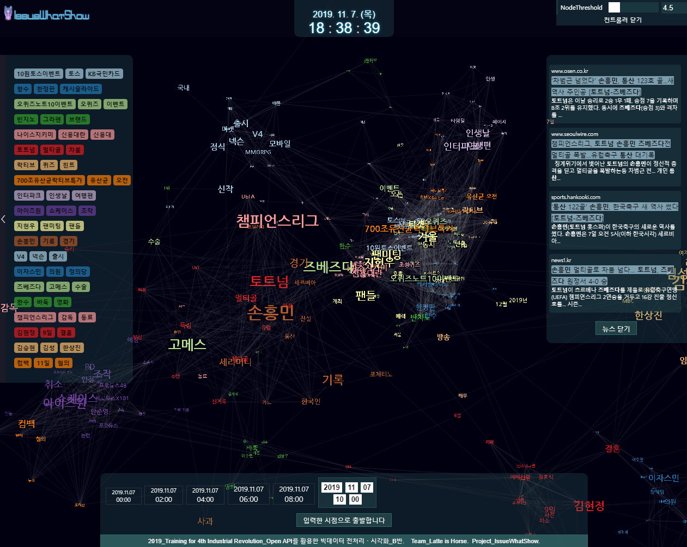
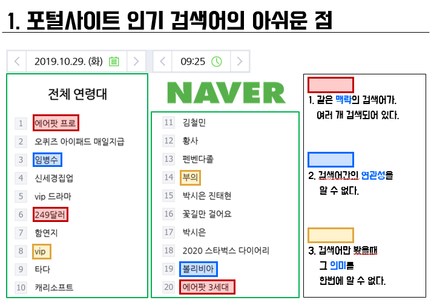
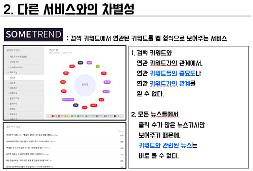

# MULTICAMPUS-2nd-project

## 잇슈왓슈(IssutWhatShow) - 한 눈에 보는 대한민국 핫이슈

:point_right: [IssueWhatShow.com](http://issuewhatshow.com)

:point_right:[발표자료 바로보기](doc\최종 제출 자료\[라떼는말이야]잇슈왓슈_PPT.pptx)

목차...TBD

### 1. 개요

**현재** 대한민국에서 일어나고 있는 **일**(핫이슈)들을 짧은 시간에 파악할 수 있도록, 이슈 키워드들을 **중요도**(크기)와 **맥락**(주변 키워드) 그리고 **연관성**(링크 및 링크 거리)을 포함하여 **3D**로 시각화하여 보여주는 `Web Application`.

**웹** 서비스는 `Spring MVC`로 구축하였으며 **수집/전처리/분석** 모듈은 `python` 코드로 짜여져있다. 

#### 1.1. 웹서비스 실행 화면

#### 1.2. 소스 구성

- **웹 서비스** - **Web**

  - `Spring MVC`
  - `Oracle RDBMS`(교육용 xe)
  - `three.js` 기반 `3d-force-graph` 시각화 라이브러리

- **수집/전처리기** - **Crawllica**

  `crawllica`: 자체 개발 수집/전처리 최상위 `python` 모듈

  - `harvesta`: 웹 문서 수집기
    - NAVER 관련 모듈
    - DAUM 관련 모듈
    - Google 관련 모듈
    - Twitter 관련 모듈
  - `preproca`: 웹 문서 전처리기
    - whitelist 처리 코드
    - blacklist 처리 코드
    - 정규표현식 기반 불용문자 제거기

- **분석기** - **Analyza2**

  `analyza`: 자체 개발 NLP 분석기 최상위 `python` 모듈

  - `morpheus`: khaiii 형태소 분석기를 이용한 형태소 분석 driver  모듈
  - `word2veca`: gensim package의 word2vec driver 모듈
  - `tfidf`: tfdif 계산 모듈

### 2. 기존 이슈 파악 방법과의 차별성

#### 2.1. 실시간 키워드 확인의 한계

> TBD

#### 2.2. 실시간 트렌트 파악의 한계

> TBD

### 3. 잇슈왓슈의 기능

#### 이슈 키워드 3D 시각화

